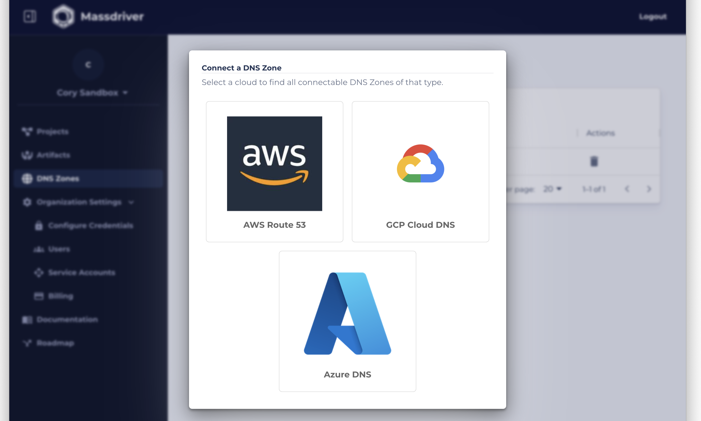
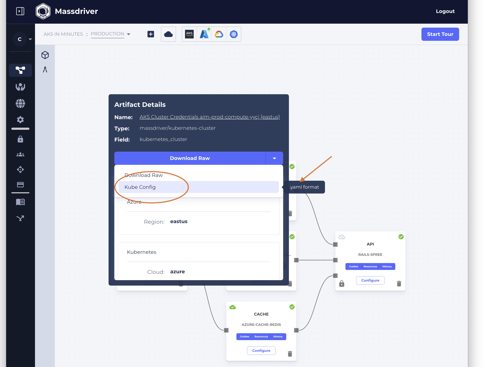

# AKS in Minutes

In this webinar you’ll learn to push docker images to the Azure Container Registry (ACR) and deploy applications to Azure Kubernetes Service (AKS) using Massdriver. We’ll discuss the best-practices, security, and compliance of various cloud resources deployed during the webinar.

We will deploy a Ruby-on-Rails Spree e-commerce API.

**Agenda**:

* Network configuration
* Configure and deploy Azure Kubernetes Service
* Configure and deploy Azure Databases
* Customizing database Alarms & Metrics
* Pushing container images to Azure Container Registry
* Managing application secrets
* Deploy your app

**Want to follow along?**

If you are interested in following along during the webinar, you'll need a few things.

* An active Azure Subscription with a Service Account
* An Azure DNS Zone
* The [massdriver CLI](https://github.com/massdriver-cloud/mass/releases/)
* _Optional_: Dockerized app using one of PostgreSQL, MySQL, or MongoDB. Alternatively this example [docker image](https://hub.docker.com/r/massdrivercloud/rails-spree-example) can be used.

Source code for the application / docker image can be found [here](https://github.com/massdriver-cloud/spree_starter).

## Follow Along

To get started, log into [Massdriver](https://massdriver.cloud/register).

### Connect your Azure Subscription

You'll need to connect an Azure Subscription to follow this tutorial.

Visit your organization [credentials](https://app.massdriver.cloud/organization/credentials) page by clicking the `lock` icon on the sidebar.

Select Azure:


Follow the onscreen instructions:


### Connect DNS Zone

Connecting a DNS Zone will allow Massdriver to register DNS records for your web services.

Visit the [DNS Zones](https://app.massdriver.cloud/dns-zones) page by clicking the `world` icon on the sidebar.


Select Azure:



Select a DNS Zone you'd like to use:


You'll be able to use this DNS Zone throughout your projects in Massdriver!

### Create a Service Account

Creating a service account will allow you to interact with Massdriver from the [command line](https://github.com/massdriver-cloud/mass). You'll typically use this in your CI/CD pipeline (with our [GitHub Actions](https://github.com/massdriver-cloud/actions)), but during this tutorial we'll use it to publish your apps manually.

Visit the [Service Acccounts](https://app.massdriver.cloud/organization/api-keys) page by clicking the `diamond` icon in the sidebar.


Click 'Add Service Account', fill in a name for your service account, and click the `copy` icon. You'll need your service account key at the command line.

```shell
MASSDRIVER_API_KEY=YOUR_KEY_HERE
```

You'll also need your Organization ID:

Hover over your organization name in the sidebar, and click `copy`


```shell
MASSDRIVER_ORG_ID=YOUR_ORG_ID
```

### Designing Infrastructure

To run your application on infrastructure managed by Massdriver, you'll need to 'publish' your application into your Massdriver registry.

You'll typically use the CLI to generate boilerplate code to integrate publishing into your CI/CD pipeline (`mass bundle new`), but for this tutorial we will use the example in the `./deploy` directory.

This directory contains metadata about your app, including its cloud infrastructure dependencies, necessary secrets, and IAM policy bindings. It also allows you to customize the user interface and validation rules in Massdriver for configuring your application.

This will publish the deployment and configuration for your application to Massdriver so it can manage your application workloads. Massdriver _never_ gets access to your actual source code. 🎉

```shell
cd deploy/
mass bundle publish
```


### Designing your Infrastructure

Before we create our infrastructure, we'll need to make a project and an environment (production, staging) to run our infrastructure and application in.

Navigat to your [projects](https://app.massdriver.cloud/projects) page by clicking the `graph` icon in the sidebar.


Click "Create Project" and fill in your project details. The `abbreviation` should be a short alphanumeric value that will be used as the prefix for all managed cloud resources.


Click `Add Environment`


And fill in your environment details. Again, you'll need a unique identifier for this environment, try `staging` or `prod`.


After creating your environment, you'll end up on the architecture canvas. Click the `package` icon on the sidebar and search for "rails." You should see the application we published earlier. If you published your own application, instead search for its name.


Drag the bundle on to the canvas. You'll be presented with a form to set the details for your app. Massdriver manages parity of your infrastructure and application across application environments (beta, staging, production), regions (US, EU, etc), and preview environments.

The manifest name and abbreviation are how you will refer to your application in the generic sense across all environments.

If you are using the provided application, use `api` since this is an ecommerce API.


You should see your API on your canvas with 3 black boxes on the side. These are your infrastructure dependencies. You can open the sidebar and drag on the required infrastructure, or hover your mouse over a black box and Massdriver will recommend infrastructure.


Do this for each box selecting the following pieces of infrastructure:
* massdriver/azure-aks-cluster
* massdriver/azure/postgresql-flexible-server
* massdriver/azure-cache-redis

Your diagram should look like the following.


Finally generate an `azure-virtual-network` and connect it to your kubernetes cluster, postgres database, and redis servers.

Your canvas should look like this.


### Deploying Infrastructure

Before we deploy infrastructure, we need to set the credentials for this project. Click the Azure icon at the top of your canvas.

Select the credential you added during the first step and click "Save."


Click "configure" on your network:

Select "eastus" as it has the most compute options and optionally set your network size. Massdriver supports Auto CIDR which selects a CIDR block based on your desired IP space and unused blocks in your Azure account.


Click "Deploy" and the network will be provisioned.

Massdriver handles provisioning of cloud infrastructure and state management similar to other services like Terraform Cloud or Spacelift.


Once the network has finished provisioning we can deploy Kubernetes, PostgreSQL, and Redis.

When configuring infrastructure in Massdriver there is a "Configuration Presets" at the top of the configuration screen.

Presets are great ways to get started with infrastructure you _know_ you need, but may not have managed before. 

**For this tutorial we recommend selecting 'Development' presets to minimize costs.**


First configure your Kubernetes cluster.

Select the 'development' present and then enabled ingress so traffic can reach your apps and select the DNS zone you added earlier.


While Kubernetes is provisioning, you can deploy Postgres and Redis in parallel. Select the 'development' preset for both and click 'Deploy.'

### Deploying your Application

Congrats, at this point you should have a virtual network, a Kubernetes cluster, PostgreSQL, and Redis running. 

The infrastructure for a three-tiered web architecture running in your Azure account in minutes!

Next lets get your application deployed.

Click the `lock` icon on your app. This apps configuration (see `./deploy`) included definitions for a few application secrets. You'll need to set those values here before deploying. You'll notice there are no secrets for Postgres or Redis authentication. Massdriver takes can of these automatically for you.

Put in your email address into the admin field, set a password, and put any value into the "Secret Key Base" clicking save after each. Massdriver stores your application secrets using in an isolated virtual private cloud using per-row encryption.


After your secrets are set, you are ready to deploy your application.

Fill in the following values:

* Repository: `massdrivercloud/rails-spree-example`
* Tag: `latest`
* Rails Environment: `production` 
* Database Name: `ecomm`
* Port: `3000`


You'll also need to enable `Public Internet Access` and put in the hostname for your app. The hostname will need to be an unused DNS record in the DNS Zone you set on your cluster.


Click "Deploy" and after a seconds your application should be deployed. DNS propogation can take a minute.

Visit: `https://YOUR_HOSTNAME/admin` to see the admin landing page for your app.


You won't be able to log in at this point in time, we need to run a few ruby scripts to set up the database.

Click on the `guides` button on your application's icon on your canvs. This is a custom guide or runbook that you can include with your application (see `./deploy/operator.md`). We'll need to follow the instructions here to log in and access our ecommerce admin portal.


To "SSH" or "exec" into your running kubernetes pods you'll need a Kubernetes credential. This can be downloaded right from your canvas.

Hover over the black box on the right side of your kubernetes manifest. Select "Kube Config" from the dropdown and then click download.



You can list your applications pods using the following command. Make sure to use the file name for _your_ config file and kubernetes namespace.

```shell
kubectl get pods -n ecomm --kubeconfig /path/to/your/download.yaml
```

You should see two pods:

1. A database migration job
2. A rails server


Exec into a running pod to run the commands from your apps 'guide' page.

```shell
kubectl exec YOUR_RUNNING_POD_NAME -n ecomm --kubeconfig /path/to/your/download.yaml -it -- /bin/bash
```

The following commands will create the admin user account and ecommerce products:

```shell
bundle exec rake db:seed
bundle exec rake spree_sample:load
```


You should now be able to visit the admin page of your app at `https://YOUR_HOSTNAME/admin` and log in with the email/password you set in your secrets.

Navigate around and check out your ecommerce store!


## Links to Infrastructure Terraform Modules

The Terraform modules for the infrastructure used in this webinar/tutorial are open-sourced.

* [network](https://github.com/massdriver-cloud/azure-virtual-network)
* [k8s](https://github.com/massdriver-cloud/azure-aks-cluster)
* [postgresql](https://github.com/massdriver-cloud/azure-postgresql-flexible-server)
* [redis](https://github.com/massdriver-cloud/azure-cache-redis)
